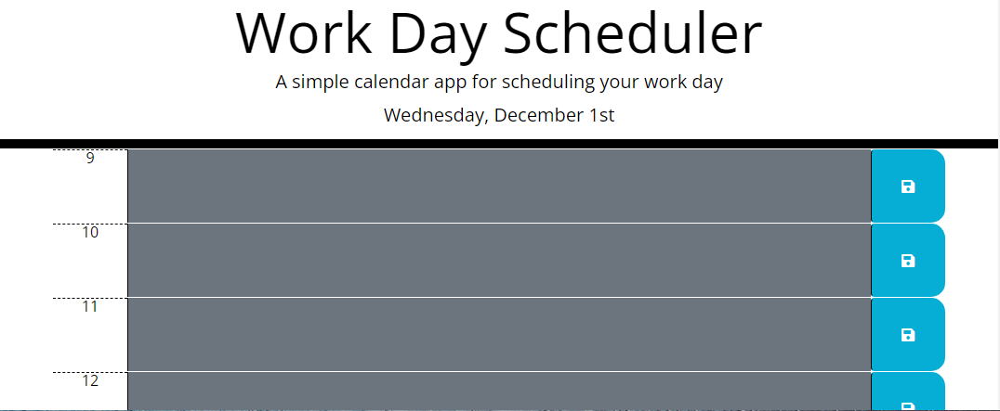

# Work Day Scheduler

## Table of Contents
- [Description](#Description)
- [Link](#Link)
- [Visuals](#Visuals)

## Description

This scheduler tracks your work day from 0900 hrs to 1700 hrs (9am to 5pm). You are able to make notes and save them to the local storage in your web browers. Once you type into the long box, you just have to click the blue button on the end and your item is saved. This was built using HTML, CSS, and JQuery.

## Link
[Work Day Scheduler](https://wparker05.github.io/work-day-scheduler/)

## Visuals

